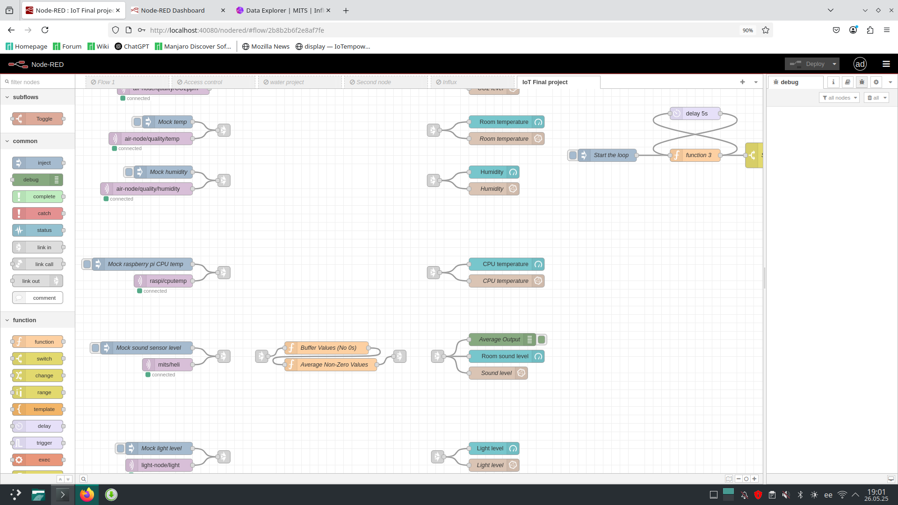
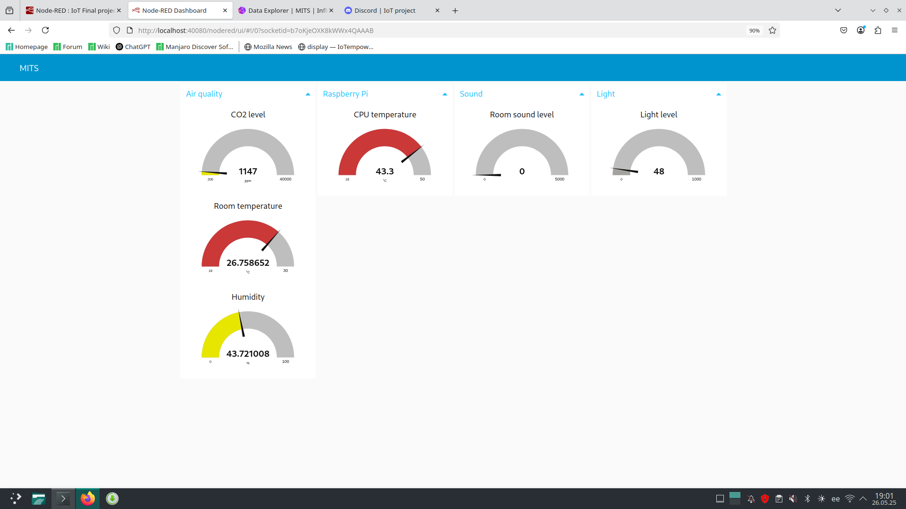

# Project introduction

The project is for collecting environmental data in MITS room in Delta (room nr 3064)

Project members are Kevin Akkermann, Kustav Prants, Joosep P, 

### Initial story 
Situation: 

There is a room in Delta for a student society (MITS), that has several problems. There is no air (ventilation does not work and need to open the door once in a while), sharing the cabinet key is cumbersome, the lights are not turned off at the end of the day. Also in the meetings, they can get pretty loud, so we could monitor the level as well.

Characters:
- MITS member (Kevin)
- Other MITS members who are mad because Kevin has used up all the good air in the room

Space:
- Small room
- manual lights
- lockable cabinets
- no ventilation

Features:
- The cabinet doors can be (un)locked from a dashboard (webpage)
- The lights can be controlled from the app, hard turn off at the end of the day
- CO2 level and temp sensor to monitor the air quality in the room
- Alerts on the dashboard (webpage) when quality poor or falling.

## Final features:
- Air quality sensor for CO2, temp, humidity ([scd4x](Sensor code/CO2Sensor/setup.cpp))
	- Helps monitor if the door needs to be opened
	- Also gives us data to submit to the building so they could help us figure out a solution
- Sound level (microphone) sensor ([inmp441 nr0560](Sensor code/Microphone/setup.cpp))
	- Helps monitor the sound level of meetings, who is the loudest
	- Mainly for fun
- Ambient light sensor for light level ([BH1750](Sensor code/Light Sensor/setup.cpp))
	- Can use it to figure out if someone left the light on in the evening
	- Also if anyone is in the room currently.
- [OLED screen](Sensor code/Display/setup.cpp) to display current information
	- Cycles through different stats, also shows time.
- [InfluxDB webpage](https://iot.mits.ee/signin) to show historical data
	- Good for monitoring
	- Hosted on HPC Compute servers ([ETAIS](https://etais.ee/en/))
- Raspberry PI with Node-RED
	- Integrates the sensors, Influx DB and the screen
- Mango router with MQTT broker.
- Case/Box [Model](models/) made using freecad and 3D printed

[Demo is here](https://youtu.be/cNSxGGneTIk)

## Issues

We had to scrap the cabinet lock idea as we could not attach it in any meaningful way (not allowed to drill, adhesive is not practical)

We couldn't control the lights remotely so had to limit ourselves with measuring the light level.

Installing the Node-RED on raspberry pi was cumbersome but finally managed. Developed the flow on the gateway laptop and imported it to the raspi later.

## Pictures

